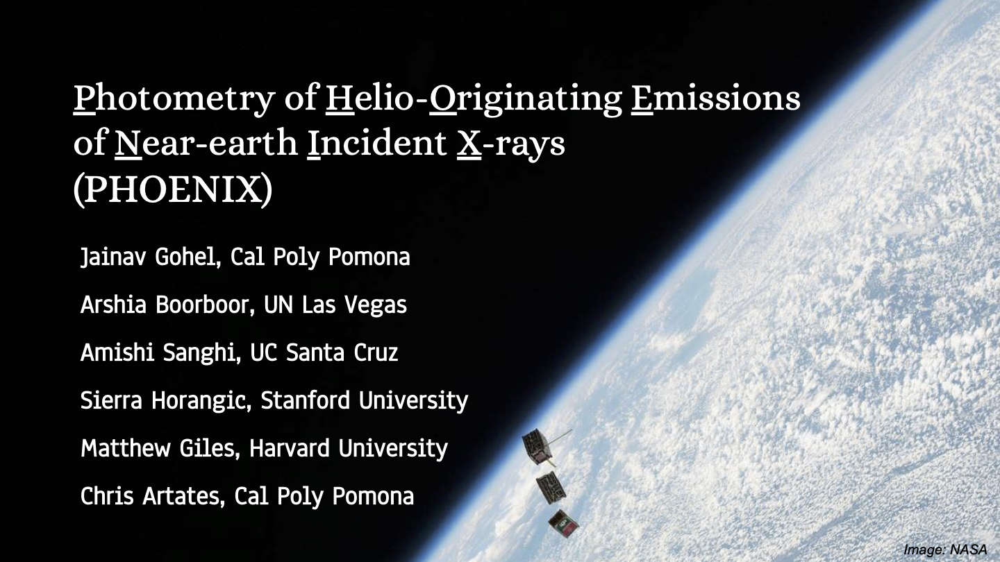

## Mission Statement

What will the satellite try to accomplish in space?

- Study solar flares and their influence on Earth’s atmosphere during geomagnetic storms by measuring solar spectra soft X-rays via X-ray fluorescence spectrometry.

How will this CubeSat differ from other missions?

- It’s inspired by the University of Colorado Boulder’s MIN-XSS CubeSat, and will be an instrumentally-simplified & cost-optimized version.

## [Presentation](/_site/teams/phoenix/Phoenix_Presentation_1-11-2021.pdf) | [Recording](https://youtu.be/Lyt3gIv0D-0)

{: .mx-auto.d-block :}
