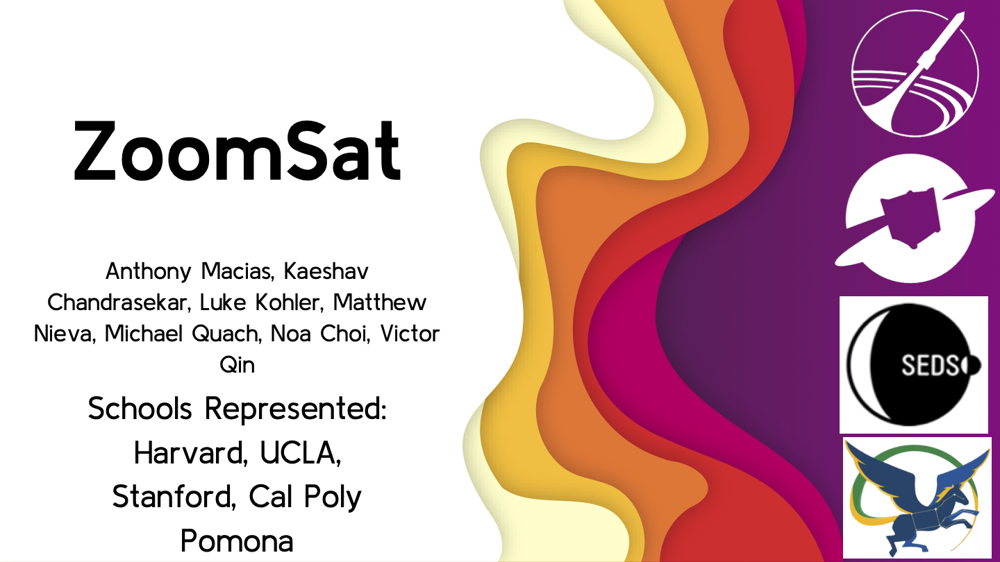

## Mission Statement

Devastating forest fires, with billions in damage and claiming dozens of lives, are becoming more common from climate change. Monitoring and predicting where such fires begin is difficult, and it is difficult to distinguish forest fire risk by eye alone.

The evapotranspiration of plants is correlated with forest fire risk. Healthy-looking plants that evaporate lesswater are more likely to burn. However, there are very few IR sensors in orbit that measure evapotranspiration.

We propose to launch ZoomSat into Low Earth Orbit to collect evapotranspiration data and predict forest fire risk in California and the United States.

## [Presentation](ZoomSat_Presentation_1-11-2021.pdf) | [Recording](https://youtu.be/4iuP1f3b1CI)

{: .mx-auto.d-block :}
